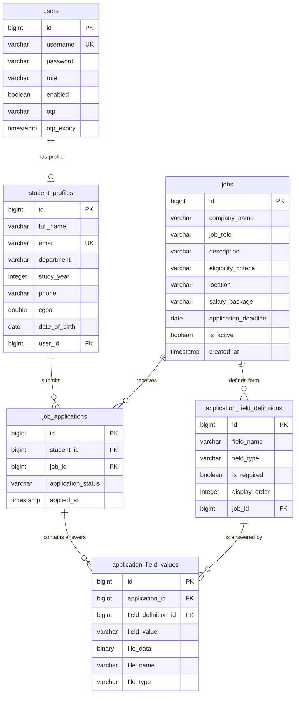

# STUDENT PLACEMENT HUB — CAMPUS PLACEMENT MANAGEMENT PORTAL

### Project Report

---

## 1. ABSTRACT

The **Student Placement Hub** is a centralised, web-based campus placement management system designed to replace the manual, spreadsheet-and-email driven process typically followed by a college placement cell. The system brings two distinct classes of users — the **Placement Administrator** and the **Student** — onto a single controlled platform where recruitment drives are published, student records are maintained, and job applications are collected, validated, tracked and exported.

The defining concept of the project is its **dynamic application form engine**. Rather than forcing every company to use one fixed application form, the administrator defines a *custom set of fields* for each individual job posting at the time of creating it. The student's application form is then generated automatically from that definition. This allows one system to serve a company that wants only a resume link, and another that wants a resume file, a cover letter, an expected salary figure and an availability date — with no change to the underlying system.

The portal enforces a strict one-application-per-student-per-job rule, validates every submission against the field rules defined by the administrator, stores uploaded resume files securely against the application record, sends automated acknowledgement emails to applicants, and gives the placement cell one-click consolidated exports of applicant data and resume bundles for handover to recruiters.

---

## 2. INTRODUCTION

Campus placement is one of the most information-heavy activities a college conducts. In a single placement season a placement cell may deal with dozens of visiting companies, hundreds of eligible students, and thousands of individual applications — each carrying a resume, a set of academic details, and company-specific answers.

When this is handled manually, the process typically fragments into circulated notices, shared spreadsheets, email inboxes full of resumes with inconsistent file names, and repeated manual cross-checking. The consequences are predictable: students miss deadlines because notices did not reach them, duplicate and incomplete applications enter the pipeline, resumes get lost or misattributed, and the placement officer spends more time consolidating data than actually coordinating with recruiters.

The Student Placement Hub addresses this by making the placement cell the single authority over a structured, auditable pipeline. Every job posting, every student record, and every application exists as a first-class record in one system, related to one another by design, so that consolidation becomes a query rather than a clerical exercise.

---

## 3. PROBLEM STATEMENT

The existing manual placement workflow suffers from the following concrete problems:

| # | Problem | Consequence |
|---|---------|-------------|
| 1 | Job notifications circulated informally | Students miss opportunities and deadlines |
| 2 | Applications collected over email / paper | No structure, no validation, no single view |
| 3 | No control over duplicate submissions | The same student appears multiple times for one role |
| 4 | Every company wants different information | A single fixed form cannot serve all recruiters |
| 5 | Resumes arrive as loose attachments | Files get lost or cannot be traced to an applicant |
| 6 | Incomplete applications accepted | Mandatory information missing at shortlisting stage |
| 7 | Manual compilation of applicant lists | Slow, error-prone, and repeated for every company |
| 8 | No acknowledgement to the student | Students repeatedly follow up on submission status |
| 9 | Student records maintained separately | Academic data and application data never reconcile |
| 10 | No access control | Anyone with the file can view or alter placement data |

**Problem definition:** *To design and implement a secure, role-based, centralised placement portal in which the placement cell can publish job openings with company-specific application requirements, maintain verified student records, and collect validated, duplicate-free applications with attached documents — while providing students a self-service interface to browse openings, apply, and track their application status.*

---

## 4. OBJECTIVES

**Primary objectives**

1. To provide a single centralised platform for all campus placement activity.
2. To implement strict role separation between administrator and student, with each role able to access only its own functions and data.
3. To enable the administrator to define a **custom application form per job posting**, so that the system adapts to each recruiter's requirements instead of the reverse.
4. To automatically enforce every rule the administrator defines — mandatory fields, field data types, and submission deadlines.
5. To guarantee data integrity by preventing duplicate applications at the storage level.
6. To securely accept, store and retrieve resume and document uploads tied to a specific application.

**Secondary objectives**

7. To acknowledge every application automatically by email, removing manual follow-up.
8. To provide consolidated, downloadable applicant reports and resume bundles for recruiter handover.
9. To give students a transparent view of their own application history and status.
10. To provide controlled, verifiable password management for both roles.
11. To present all of this through a clean, responsive interface usable on both desktop and mobile.

---

## 5. SCOPE OF THE PROJECT

### 5.1 In Scope

- Administrator-controlled creation and lifecycle management of student accounts.
- Job posting lifecycle: creation, editing, activation/deactivation, deletion.
- Per-job dynamic application field definitions across eight field types.
- Student browsing of active openings with deadline awareness.
- Validated application submission with document upload.
- Duplicate application prevention.
- Application tracking for students; application review for administrators.
- Departmental filtering and searching of students and applications.
- Consolidated report generation and resume bundle export.
- Automated email acknowledgement and administrator identity-verified password change.
- Role-based, session-less authenticated access to every protected function.

### 5.2 Out of Scope

- Self-registration by students (accounts are issued by the placement cell by design, so that only verified students enter the system).
- A separate login for recruiters/companies — the placement cell acts as the intermediary.
- Interview scheduling, aptitude test conduction, and offer-letter management.
- Automated eligibility filtering based on CGPA or backlog rules (eligibility is stated descriptively and enforced by the placement cell).
- Payment, fee, or attendance management.

---

## 6. EXISTING SYSTEM vs. PROPOSED SYSTEM

| Aspect | Existing Manual System | Proposed Portal |
|--------|------------------------|-----------------|
| Job announcement | Notice boards, informal messages | Published centrally, instantly visible to all students |
| Application form | One fixed format, or ad-hoc email | Custom form generated per job from admin definition |
| Field validation | Manual visual checking | Enforced automatically on submission |
| Duplicate applications | Detected only during compilation, if at all | Structurally impossible |
| Deadline enforcement | Manual, inconsistent | Automatic; closed jobs cannot be applied to |
| Resume handling | Loose email attachments | Stored against the specific application record |
| Applicant list for recruiter | Compiled by hand per company | Generated on demand as a single export |
| Acknowledgement to student | Usually none | Automated email on every submission |
| Application status visibility | Student must ask the placement cell | Visible to the student at any time |
| Data security | Uncontrolled file access | Role-based access; passwords stored irreversibly encrypted |
| Auditability | Poor | Every application timestamped and attributable |

---

## 7. SYSTEM OVERVIEW

### 7.1 Conceptual Architecture

The system is organised as a **layered, service-oriented application** with a clear separation between the interface the user sees and the logic that governs the data.

```
┌──────────────────────────────────────────────────────────────┐
│                     PRESENTATION LAYER                       │
│   Role-aware interface — Login, Dashboards, Management       │
│   screens, Application forms, Reports                        │
│   (routes are guarded; a role only ever renders its own UI)  │
└────────────────────────────┬─────────────────────────────────┘
                             │  authenticated requests
┌────────────────────────────▼─────────────────────────────────┐
│                      SECURITY LAYER                          │
│   Identity verification → Token validation → Role check      │
│   (every protected request passes through, without exception) │
└────────────────────────────┬─────────────────────────────────┘
                             │
┌────────────────────────────▼─────────────────────────────────┐
│                       INTERFACE LAYER                        │
│   Endpoint definitions grouped by role and function:         │
│   Authentication │ Administration │ Student │ File Retrieval  │
└────────────────────────────┬─────────────────────────────────┘
                             │
┌────────────────────────────▼─────────────────────────────────┐
│                    BUSINESS LOGIC LAYER                      │
│   Authentication · Student · Job · Application ·             │
│   Notification · Token services                              │
│   (all rules, validations and workflows live here)           │
└────────────────────────────┬─────────────────────────────────┘
                             │
┌────────────────────────────▼─────────────────────────────────┐
│                    DATA ACCESS LAYER                         │
│   Persistence abstractions for each entity                   │
└────────────────────────────┬─────────────────────────────────┘
                             │
┌────────────────────────────▼─────────────────────────────────┐
│                      DATA STORE                              │
│   Six related tables holding users, profiles, jobs,          │
│   field definitions, applications and field values           │
└──────────────────────────────────────────────────────────────┘
```

**Design rationale for the layering**

- **No business rule lives in the interface.** The presentation layer disables an expired job's Apply button as a courtesy, but the business layer independently validates every submission. A rule bypassed in the browser is still caught on the server.
- **The security layer is unconditional.** Authorisation is applied by URL group *and* re-asserted at the method level, so a new endpoint added under a role's path inherits that role's protection by default.
- **Stateless authentication.** No server-side session is retained. Each request carries its own proof of identity and role, which keeps the system horizontally scalable and immune to session-fixation problems.

### 7.2 Component Responsibilities

| Component | Responsibility |
|-----------|----------------|
| **Authentication Service** | Verifies credentials, issues identity tokens, handles all password change and reset flows including OTP verification |
| **Token Service** | Creates signed identity tokens carrying username and role; validates signature, ownership and expiry on every request |
| **Student Service** | Account creation, profile retrieval and update, deletion, searching, filtering, student data export |
| **Job Service** | Job lifecycle management and, critically, the creation and replacement of each job's custom field definitions |
| **Application Service** | The core workflow: duplicate detection, mandatory-field validation, field-value and file persistence, applicant retrieval, report and bundle generation |
| **Notification Service** | Asynchronous dispatch of application acknowledgements and administrator OTPs |
| **File Retrieval Component** | Serves a stored document back to an authorised user with its original name and type |
| **Bootstrap Component** | Creates the initial administrator account on first startup so the system is never locked out |
| **Global Error Handler** | Converts every failure into a single, predictable error format |

---

## 8. USER ROLES AND PRIVILEGES

The system recognises exactly **two roles**. There is no shared or intermediate privilege level.

### 8.1 Administrator (Placement Officer)

The administrator is the authority in the system. The role exists once at bootstrap and manages everything else.

| Function | Capability |
|----------|-----------|
| Student accounts | Create, view, search, filter, update, delete |
| Student credentials | Reset any student's password |
| Student data | Export the full student register, or a single department's, as a report |
| Job postings | Create, view, update, delete; activate or deactivate visibility |
| Application forms | Define, reorder and replace the custom fields of any job |
| Applications | View all applications for any job; filter them by department |
| Documents | Download any applicant's uploaded document |
| Reports | Export an applicant report per job; export a complete bundle of applicant data plus all resumes |
| Own credentials | Change own password, subject to email OTP verification |

### 8.2 Student

The student has a deliberately narrow, self-service scope confined to their own data.

| Function | Capability |
|----------|-----------|
| Profile | View and update own profile |
| Jobs | Browse only *active* postings; view full details of a posting |
| Application | Apply to a job once, through that job's generated form, with document upload |
| Tracking | View own application history with company, role, date, documents and current status |
| Documents | Re-download own submitted documents |
| Own credentials | Change own password by supplying the current one |

### 8.3 Privilege Boundaries — What a Role *Cannot* Do

The negative space of the permission model is as important as the positive:

- A student **cannot** see, create, edit or delete any other student.
- A student **cannot** see inactive job postings, and cannot see the applicant list for any job.
- A student **cannot** apply twice to the same posting, or apply to a posting past its deadline.
- A student **cannot** create their own account — enrolment is controlled entirely by the placement cell.
- An administrator **cannot** change their own password without proving control of the registered institutional email through an OTP.
- An administrator **cannot** use the student password-reset facility to alter another administrator's password — the operation explicitly rejects any target that is not a student.

---

## 9. MODULE DESCRIPTION

The system comprises **seven functional modules**.

### Module 1 — Authentication and Access Control

The gateway to the system. A single login entry point serves both roles; the role is determined from the stored account, not from anything the user supplies, and the interface routes the user to the appropriate dashboard based on the role returned.

- Credentials are verified against an **irreversibly encrypted** stored password. The plain password is never stored and cannot be recovered from the system — only reset.
- Disabled accounts are rejected even when the password is correct.
- On success, the user receives a **signed identity token** carrying their username and role, valid for **24 hours**.
- Every subsequent protected request is intercepted, the token's signature and expiry are verified, and the role is established before the request reaches any business logic. An invalid or tampered token results in an unauthenticated request, never a partially trusted one.
- The interface additionally monitors token expiry and logs the user out automatically when the validity period ends, and immediately clears local credentials if any request is rejected as unauthorised.

### Module 2 — Student Management

Owned entirely by the administrator, this module maintains the register of students eligible to participate in placements.

- **Creation** establishes two linked records simultaneously — a login account and an academic profile — as one atomic operation. Either both exist or neither does.
- **Uniqueness** is enforced on both username and email address before creation proceeds.
- **Searching and filtering** support partial, case-insensitive name search, department filtering, or both together, with results paginated for large registers.
- **Updating** revises profile details; the email address is re-checked for uniqueness only if it has actually changed, and the password is re-encrypted only if a new one was supplied — a blank password field means "leave it unchanged".
- **Deletion** removes the account and, by cascade, its profile and its entire application history, keeping the data store free of orphaned records.
- **Export** produces a downloadable student register, optionally narrowed to a single department.

### Module 3 — Job Posting Management

The administrator's tool for publishing recruitment drives.

Each posting records the company name, the role offered, a full description, the stated eligibility criteria, the location, the compensation package, the application deadline, and an **active flag** that controls whether students can see it at all. A creation timestamp is stamped automatically and is immutable.

The active flag is what makes the module practical: a posting can be prepared in advance while invisible, published by activation, and withdrawn from student view without deleting the posting or losing the applications already received.

Deleting a job cascades to its field definitions and all its applications — a deliberate design decision, surfaced to the administrator as an explicit confirmation warning before the action is carried out.

### Module 4 — Dynamic Application Form Engine *(the core innovation)*

This module is what distinguishes the project from a conventional placement portal.

**The concept.** Instead of one application form hard-coded into the system, each job carries its own **list of field definitions**. A field definition records four things:

| Property | Purpose |
|----------|---------|
| **Field name** | The label the student sees, and the key the answer is stored under |
| **Field type** | Determines the input control shown and the kind of data accepted |
| **Required flag** | Whether the application can be submitted without this field |
| **Display order** | The position of the field in the generated form |

**Supported field types (eight):**

| Type | Student sees | Typical use |
|------|--------------|-------------|
| `TEXT` | Single-line input | Roll number, skill summary |
| `TEXTAREA` | Multi-line input | Cover letter, statement of purpose |
| `URL` | Link input | Portfolio, GitHub, LinkedIn, online resume |
| `NUMBER` | Numeric input | Expected salary, years of experience |
| `DATE` | Date picker | Availability date, certification date |
| `EMAIL` | Email input | Alternate contact address |
| `PHONE` | Telephone input | Alternate contact number |
| `FILE` | File chooser | Resume, marksheet, certificate |

**How the form comes to life.** When a student opens a posting, the system fetches that job's field definitions, sorts them by display order, and renders the appropriate input control for each type — a text area for `TEXTAREA`, a file chooser for `FILE`, a typed input for the rest. The student's answers are collected against the field names, uploaded files are transmitted alongside as a distinct part of the submission, and each answer is stored linked to *both* the application and the definition it answers.

**Editing a job's form.** When the administrator revises a posting's fields, the previous definitions are removed and the new set is written in their place, so the form always reflects the current definition rather than an accumulation of past edits.

**Why this design matters.** A recruiter requirement that would normally demand a code change and redeployment — "we also need their expected joining date and a scanned marksheet" — becomes a two-minute configuration change made by a non-technical placement officer through the interface.

### Module 5 — Application Processing

The transactional heart of the system. A submission passes through an ordered sequence of gates, and failing any one of them aborts the entire submission:

```
   Student submits application
              │
              ▼
   ┌──────────────────────────────────────────┐
   │ 1. Is the payload structurally complete? │──✗──► Rejected: bad request
   └──────────────────┬───────────────────────┘
              ▼
   ┌──────────────────────────────────────────┐
   │ 2. Does the applicant profile exist?     │──✗──► Rejected: not found
   └──────────────────┬───────────────────────┘
              ▼
   ┌──────────────────────────────────────────┐
   │ 3. Does the job posting exist?           │──✗──► Rejected: not found
   └──────────────────┬───────────────────────┘
              ▼
   ┌──────────────────────────────────────────┐
   │ 4. Has this student already applied?     │──✓──► Rejected: duplicate
   └──────────────────┬───────────────────────┘
              ▼
   ┌──────────────────────────────────────────┐
   │ 5. Are ALL required fields satisfied?    │──✗──► Rejected: missing field
   │    (text answers AND required uploads)   │       (named explicitly)
   └──────────────────┬───────────────────────┘
              ▼
   ┌──────────────────────────────────────────┐
   │ 6. Persist application record            │
   │ 7. Persist every field value / document  │
   │ 8. Dispatch acknowledgement email        │
   └──────────────────┬───────────────────────┘
              ▼
      Application confirmed to student
```

**Key characteristics of this module:**

- **Duplicate prevention operates at two levels.** The logic checks for an existing application before proceeding, *and* the data store itself carries a uniqueness constraint on the student–job pair. Even a simultaneous double submission cannot produce two applications.
- **The whole submission is atomic.** The application record, all its field values, and all its uploaded documents are written as one transaction. A failure at step 7 does not leave a half-formed application behind.
- **Required-field validation is type-aware.** For an ordinary field the check is for a non-empty answer; for a file field the check is for an actually-present, non-empty upload. The rejection message names the specific field at fault, so the student knows exactly what to fix.
- **Documents are stored against the record, not on a loose file path**, and retain their original filename and content type so they can be served back correctly.
- **Status lifecycle.** An application carries one of four states — `PENDING`, `SUBMITTED`, `ACCEPTED`, `REJECTED` — and is created in the `SUBMITTED` state, meaning "received and under review".
- **Email dispatch is asynchronous and non-blocking.** Acknowledgement failure is recorded but never propagates to the student as an application failure. A mail-server outage must not be allowed to reject a valid application.

### Module 6 — Reporting and Data Export

This module converts stored data into artefacts the placement cell can actually hand to a recruiter.

**Applicant report (per job).** A tabular export listing every applicant's identifier, name, email, status and submission timestamp, followed by one column per custom field for that job — so a recruiter's own questions appear as their own columns. A dedicated column carries retrieval references for each applicant's uploaded documents.

**Complete applicant bundle (per job).** A single downloadable archive containing the applicant report *plus* every uploaded document, organised into a dedicated folder and renamed systematically as *student name → application identifier → field name → original filename*. This single feature replaces what is otherwise the most tedious task in the placement cycle: assembling and correctly labelling several hundred resumes for one company.

**Student register export.** The full student list, or a single department's, as a tabular report.

**Departmental filtering** applies to both applicant views and exports, letting the placement cell serve a company recruiting only from specific branches.

Both exports guard against producing an empty artefact — a request for a job with no applications is reported as such rather than yielding an empty file.

### Module 7 — Notification and Credential Management

**Application acknowledgement.** Every successful submission triggers a personalised email to the applicant confirming the company, the role, and that the application is under review. The module resolves the destination address intelligently: the student's registered email is used by default, but if the application itself carried an email-type answer, that address is preferred — respecting a student who deliberately supplied an alternate contact for that specific company.

**Administrator password change — OTP verified.** Because the administrator account governs the entire system, its password cannot be changed by simply knowing the old one. The flow is:

```
Admin requests change
        │
        ▼
System verifies the requester is genuinely an administrator
        │
        ▼
A 6-digit one-time code is generated and stored with a 10-minute expiry
        │
        ▼
The code is emailed to the registered institutional address
        │
        ▼
Admin submits the code with the new password
        │
        ├── code absent or mismatched ──► rejected
        ├── code past its expiry ────────► rejected
        └── code valid ──► password re-encrypted and stored;
                           the code is cleared so it can never be reused
```

**Student password change.** A student changes their own password by supplying the current one, which is verified before the change is accepted.

**Administrative password reset.** The administrator can reset a student's password directly — for the routine case of a student who has forgotten it. The operation explicitly refuses any target account that is not a student, so it can never be turned against an administrator account.

---

## 10. DATABASE DESIGN

### 10.1 Design Philosophy

The schema is built around a single decision: **the custom-field mechanism is modelled relationally rather than as unstructured stored text.**

A simpler implementation would dump each application's answers into one free-form blob. This schema instead separates the *definition* of a field (`application_field_definitions`, owned by a job) from an *answer* to that field (`application_field_values`, owned by an application). Each answer therefore points at both the application it belongs to and the definition it answers.

This costs two extra tables and buys three properties that matter:

1. Answers remain **queryable and reportable** — a report can produce one column per field because the fields are real records.
2. A field's **metadata is never duplicated** across the hundreds of applications that answer it.
3. Referential integrity is real: an answer cannot exist for a field that was never defined for that job.

### 10.2 Entity–Relationship Diagram



### 10.3 Table Specifications

**1. `users` — credentials and role**

| Column | Type | Constraints | Purpose |
|--------|------|-------------|---------|
| `id` | BIGINT | Primary key, auto-generated | Identifier |
| `username` | VARCHAR | Unique, not null | Login identity |
| `password` | VARCHAR | Not null | Irreversibly encrypted password |
| `role` | ENUM | Not null — `ADMIN` \| `STUDENT` | Authorisation basis |
| `enabled` | BOOLEAN | Not null, default true | Allows suspension without deletion |
| `otp` | VARCHAR | Nullable | Transient one-time code |
| `otp_expiry` | TIMESTAMP | Nullable | Validity limit of the code |

*Design note:* credentials are separated from academic details so that authentication never needs to touch profile data, and an administrator can exist with no profile at all.

**2. `student_profiles` — academic and personal details**

| Column | Type | Constraints |
|--------|------|-------------|
| `id` | BIGINT | Primary key |
| `full_name` | VARCHAR | Not null |
| `email` | VARCHAR | Unique, not null |
| `department` | VARCHAR | Not null |
| `study_year` | INTEGER | Not null (1–4) |
| `phone` | VARCHAR | Not null (10 digits) |
| `cgpa` | DOUBLE | Not null (0.0–10.0) |
| `date_of_birth` | DATE | Nullable, must be a past date |
| `user_id` | BIGINT | Foreign key → `users.id`, unique, not null |

*Design note:* the unique foreign key enforces a strict one-to-one relationship — one login can never carry two profiles.

**3. `jobs` — recruitment drives**

| Column | Type | Constraints |
|--------|------|-------------|
| `id` | BIGINT | Primary key |
| `company_name` | VARCHAR | Not null |
| `job_role` | VARCHAR | Not null |
| `description` | VARCHAR(2000) | Nullable |
| `eligibility_criteria` | VARCHAR(1000) | Nullable |
| `location` | VARCHAR | Nullable |
| `salary_package` | VARCHAR | Nullable |
| `application_deadline` | DATE | Not null |
| `is_active` | BOOLEAN | Not null, default true |
| `created_at` | TIMESTAMP | Not null, **not updatable** |

*Design note:* compensation is stored descriptively rather than numerically, so real-world recruiter phrasing ("12 LPA + variable", "Stipend ₹25,000/month") can be recorded faithfully. `created_at` is stamped once and can never be revised, preserving the audit trail.

**4. `application_field_definitions` — the per-job form specification**

| Column | Type | Constraints |
|--------|------|-------------|
| `id` | BIGINT | Primary key |
| `field_name` | VARCHAR | Not null |
| `field_type` | ENUM | Not null — one of eight supported types |
| `is_required` | BOOLEAN | Not null, default true |
| `display_order` | INTEGER | Not null, default 0 |
| `job_id` | BIGINT | Foreign key → `jobs.id`, not null |

**5. `job_applications` — the submission record**

| Column | Type | Constraints |
|--------|------|-------------|
| `id` | BIGINT | Primary key |
| `student_id` | BIGINT | Foreign key → `student_profiles.id`, not null |
| `job_id` | BIGINT | Foreign key → `jobs.id`, not null |
| `application_status` | ENUM | Not null — `PENDING` \| `SUBMITTED` \| `ACCEPTED` \| `REJECTED`; default `SUBMITTED` |
| `applied_at` | TIMESTAMP | Not null, **not updatable** |

> **Composite unique constraint on (`student_id`, `job_id`)** — the structural guarantee that one student can hold at most one application per job. This is the single most important constraint in the schema, because it makes the duplicate-prevention rule a property of the data rather than a hope about the code.

**6. `application_field_values` — the submitted answers**

| Column | Type | Constraints |
|--------|------|-------------|
| `id` | BIGINT | Primary key |
| `application_id` | BIGINT | Foreign key → `job_applications.id`, not null |
| `field_definition_id` | BIGINT | Foreign key → `application_field_definitions.id`, not null |
| `field_value` | VARCHAR(2000) | Nullable — holds text-type answers |
| `file_data` | BINARY | Nullable — holds document content |
| `file_name` | VARCHAR | Nullable — original filename |
| `file_type` | VARCHAR | Nullable — content type, for correct retrieval |

*Design note:* the dual-column arrangement lets one table serve both text answers and uploaded documents. Exactly one side is populated per row, decided by the field's declared type, and a row is only written if it actually carries content.

### 10.4 Cascade and Integrity Rules

| Action | Cascading effect | Rationale |
|--------|------------------|-----------|
| Delete a user | Profile removed, then all their applications and answers | No orphaned academic or application data |
| Delete a job | Field definitions removed; all applications and their answers removed | A form definition and its answers are meaningless without the posting |
| Delete an application | All its field values and documents removed | Answers have no independent existence |
| Revise a job's form | Old definitions replaced wholesale | The form reflects the current definition, not accumulated history |

---

## 11. SYSTEM WORKFLOWS

### 11.1 Administrator Workflow — Running a Recruitment Drive

```
 1. Log in with administrator credentials
         │
 2. Receive identity token; land on the administration dashboard
         │
 3. ONBOARD STUDENTS
         ├── Create student accounts with academic details
         ├── System validates uniqueness of username and email
         └── Login credentials are issued to the student
         │
 4. PUBLISH THE OPENING
         ├── Enter company, role, description, eligibility, location, package, deadline
         ├── DEFINE THE APPLICATION FORM:
         │      add each field → name it → choose its type →
         │      mark required or optional → set its position
         ├── Set the posting Active (or keep it hidden until ready)
         └── Save — the student-facing form now exists
         │
 5. MONITOR
         ├── Select the job and view all applications received
         ├── Filter the applicant list by department if the recruiter is selective
         └── Open and download any applicant's documents
         │
 6. HAND OVER TO THE RECRUITER
         ├── Export the applicant report, OR
         └── Export the complete bundle — report plus every resume, systematically named
         │
 7. CLOSE OUT
         └── Deactivate the posting once the drive concludes
             (applications and history are retained)
```

### 11.2 Student Workflow — Applying for a Job

```
 1. Log in with credentials issued by the placement cell
         │
 2. Land on the student dashboard
         │
 3. MAINTAIN PROFILE
         └── Review and update personal and academic details
         │
 4. BROWSE OPENINGS
         ├── See only ACTIVE postings
         ├── Each posting shows location, package, and a deadline indicator:
         │      "Closed" · "Nd left" (urgent) · "Nd left" (comfortable)
         ├── Search by role or company name
         └── An expired posting's Apply action is disabled
         │
 5. OPEN A POSTING
         ├── Read the full description and eligibility criteria
         └── The application form appears — generated from THIS job's field definitions
         │
 6. SUBMIT
         ├── Fill every field; required ones are marked
         ├── Attach documents where the job asks for a file
         └── Submit
              │
              ├── Already applied ──────► "You have already applied for this job"
              ├── Required field empty ─► the specific missing field is named
              └── Valid ──► application recorded → acknowledgement email sent
         │
 7. TRACK
         └── View own application history — company, role, date, documents, status
```

### 11.3 Request Authorisation Flow

Every protected interaction follows the same path, with no exceptions and no shortcuts:

```
Request issued by the interface, carrying the identity token
              │
              ▼
    Is a token present and well-formed? ──No──► treated as unauthenticated
              │ Yes
              ▼
    Is the signature valid?             ──No──► treated as unauthenticated
              │ Yes
              ▼
    Is it within its validity period?   ──No──► treated as unauthenticated
              │ Yes
              ▼
    Establish the caller's identity and role
              │
              ▼
    Does the role permit this operation? ──No──► access denied
              │ Yes
              ▼
    Business rules and validation applied
              │
              ▼
    Operation performed; result returned
```

Because the interface clears stored credentials and returns the user to login the moment any request is refused as unauthorised, an expired or revoked session cannot leave a user stranded in a broken authenticated state.

---

## 12. BUSINESS RULES AND VALIDATION

### 12.1 Business Rules

| # | Rule | Enforcement point |
|---|------|-------------------|
| BR-1 | A student may hold at most one application per job posting | Logic check **and** database unique constraint |
| BR-2 | An application cannot be submitted with any required field unsatisfied | Application processing, per field definition |
| BR-3 | Only active postings are visible to students | Filtered retrieval for the student role |
| BR-4 | An application cannot be submitted after the deadline | Deadline evaluation; apply action disabled |
| BR-5 | Usernames are globally unique | Checked before account creation |
| BR-6 | Student email addresses are unique | Checked on creation and on change |
| BR-7 | Students cannot create their own accounts | No self-registration path exists |
| BR-8 | An administrator's password change requires email OTP verification | OTP generation and verification flow |
| BR-9 | A one-time code expires after 10 minutes and is single-use | Expiry check; code cleared after use |
| BR-10 | The password-reset facility may target only student accounts | Role check inside the reset operation |
| BR-11 | Identity tokens expire 24 hours after issue | Token creation and validation |
| BR-12 | A student may view only their own profile and applications | Identity resolved from the token, never from a supplied parameter |
| BR-13 | Deleting a job removes its form definition and all its applications | Cascade rules, with explicit administrator confirmation |
| BR-14 | Application and posting creation timestamps are immutable | Non-updatable columns |
| BR-15 | An export request that would produce no data is reported as an error | Emptiness check before generation |
| BR-16 | Notification failure never invalidates a successful application | Isolated, asynchronous, exception-contained dispatch |

### 12.2 Field-Level Validation

**Student record**

| Field | Rule |
|-------|------|
| Username | Mandatory; 3–50 characters; unique |
| Password | Mandatory on creation; minimum 6 characters; optional on update (blank = unchanged) |
| Full name | Mandatory |
| Email | Mandatory; valid email format; unique |
| Department | Mandatory |
| Year of study | Mandatory; between 1 and 4 |
| Phone | Mandatory; exactly 10 digits |
| CGPA | Mandatory; between 0.0 and 10.0 |
| Date of birth | Optional; must be a past date |

**Job posting**

| Field | Rule |
|-------|------|
| Company name | Mandatory |
| Job role | Mandatory |
| Application deadline | Mandatory |
| Active status | Mandatory |
| Description | Up to 2000 characters |
| Eligibility criteria | Up to 1000 characters |

**Custom field definition**

| Field | Rule |
|-------|------|
| Field name | Mandatory |
| Field type | Mandatory; one of the eight supported types |
| Required flag | Mandatory |
| Display order | Optional; defaults to first position |

**Application submission**

| Field | Rule |
|-------|------|
| Target job | Mandatory |
| Answers | Mandatory as a set; each required field must be satisfied |
| Answer length | Up to 2000 characters per text answer |
| Uploads | Required file fields must carry a genuinely non-empty file |

**Credential operations**

| Field | Rule |
|-------|------|
| Current password | Mandatory for a student-initiated change; must match |
| New password | Mandatory |
| One-time code | Mandatory for an administrator change; must match and be unexpired |

---

## 13. SECURITY DESIGN

Security is treated as a cross-cutting property of the system, applied at five distinct levels.

**1. Credential storage.** Passwords are stored using a deliberately slow, salted, one-way encryption scheme. The system holds no reversible copy of any password — even full read access to the data store yields no usable credentials. Verification works by re-encrypting the supplied password and comparing, never by decrypting the stored one.

**2. Stateless authenticated identity.** A successful login yields a cryptographically signed token asserting the user's username and role, with a fixed 24-hour lifetime. Because the signature is verified on every request, the token cannot be forged or altered — changing the role claim invalidates the signature. Because no server-side session is kept, there is no session state to hijack or fixate.

**3. Two-tier authorisation.** Access control is applied twice, independently. Whole URL groups are restricted by role, so administrative operations are unreachable by a student token and vice versa; and role requirements are additionally declared at the operation level, so a newly added operation inherits protection rather than defaulting to open.

**4. Identity derived from the token, never from the request.** A student's own profile and application operations resolve the acting student from the authenticated identity in the token. A student cannot read or modify another student's data by altering an identifier in the request, because the identifier is not what the system trusts.

**5. Defence in depth on business rules.** Every rule enforced in the interface is enforced again in the business layer. A disabled Apply button is a convenience; the deadline and duplicate checks behind it are the actual control. A request crafted to bypass the interface entirely meets the same rules.

**Supporting measures**

- Sensitive and cyclic relationships are excluded from outbound data representations, so credentials and internal object graphs are never exposed in responses.
- Login failures return one deliberately uniform message for both an unknown username and a wrong password, so the system does not reveal which usernames exist.
- Accounts can be disabled without deletion; a disabled account is refused at login even with correct credentials.
- One-time codes are single-use and time-limited, and are cleared immediately upon successful use.
- The administrator OTP is delivered only to the pre-configured institutional address, not to any address supplied in the request.
- Error responses carry a message and a status, not internal diagnostic detail.

---

## 14. ERROR HANDLING AND USER FEEDBACK

### 14.1 Centralised Error Handling

All failures are converted into one predictable structure — a timestamp, a status code, an error category and a human-readable message — regardless of where in the system they originated. Validation failures additionally carry a field-by-field breakdown so the interface can indicate precisely which inputs need correction.

| Condition | Category | Message conveyed to the user |
|-----------|----------|------------------------------|
| Record not found | Not Found | The specific entity that could not be located |
| Duplicate application | Conflict | "You have already applied for this job" |
| Invalid or missing credentials | Unauthorised | "Invalid username or password" |
| Role not permitted | Forbidden | "Access denied" |
| Input validation failure | Validation Failed | A per-field map of what is wrong |
| Unexpected failure | Internal Error | A safe, non-diagnostic message |

### 14.2 Interface-Level Feedback

- **Transient notifications** confirm every successful action and surface every failure, drawing the specific reason from the server response rather than showing a generic message.
- **Loading states** — spinners for content areas and skeleton placeholders for tables — mean the user never faces an ambiguous blank screen.
- **Empty states** distinguish "nothing exists yet" from "nothing matched your filter", each with an appropriate next action suggested.
- **Confirmation dialogues** guard every destructive action, and state the consequence explicitly — deleting a job warns that its applications will go with it.
- **An error boundary** contains any unexpected interface failure to the affected region instead of blanking the entire application.
- **Visual status encoding** — colour-coded pills for application states, and deadline badges that shift from comfortable to urgent to closed as the date approaches — lets a user read a table's meaning at a glance.
- **Automatic refresh** keeps the student's job listing current without a manual reload, so a newly published posting appears without the student needing to know to look again.
- **Contextual CGPA colouring** in student tables makes academic standing scannable across a paginated register.

---

## 15. USER INTERFACE DESIGN

### 15.1 Structure

A consistent shell surrounds every authenticated screen: a **role-aware sidebar** listing only the navigation entries that role possesses, a **top bar** carrying the user's identity, role, theme control, password control and sign-out, and the **content region** itself. Because the sidebar is generated from the role, a student is never shown a link to an administrative screen they cannot open.

### 15.2 Screen Inventory

| Screen | Role | Purpose |
|--------|------|---------|
| Login | Public | Single entry point for both roles; branded panel with theme control |
| Administration Dashboard | Admin | Module entry cards and system status overview |
| Manage Students | Admin | Paginated register with name and department search; create, edit, reset password, delete |
| Manage Jobs | Admin | Paginated posting list with deadline and activity indicators; create and edit including the form builder |
| View Applications | Admin | Job selector, departmental filter, applicant table, document downloads, report and bundle exports |
| Student Dashboard | Student | Module entry cards |
| Browse Jobs | Student | Card grid of active openings with search, deadline urgency, and the generated application form |
| My Profile | Student | Profile view with an explicit view/edit mode toggle |
| My Applications | Student | Application history with status and document access |

### 15.3 Design Principles Applied

- **Progressive disclosure.** The profile screen opens read-only and becomes editable only on an explicit action, so accidental edits are structurally unlikely and a cancel action restores the original values.
- **Guarded navigation.** Route access is checked twice — first that the user is authenticated, then that their role is permitted — with an unauthorised user redirected rather than shown a partially rendered screen.
- **Consistent interaction language.** The same table, badge, modal, empty-state and pagination patterns recur across every screen, so competence on one screen transfers to the next.
- **Responsive by construction.** Grid layouts reflow by available width rather than by fixed breakpoints, and the sidebar collapses behind a menu control on narrow screens.
- **Light and dark themes** are available throughout, including on the login screen, with the choice persisted across sessions.
- **Deadline urgency is visual, not textual.** A student scanning twenty postings sees which ones are closing without reading twenty dates.

---

## 16. TESTING

### 16.1 Approach

The system was verified through **functional, integration and security testing**, driven by a documented collection of every endpoint together with a suite of scripted verification routines covering each module in sequence — authentication, student management, job management, application submission, and access control.

### 16.2 Coverage

| Area | Cases verified |
|------|----------------|
| **Authentication** | Valid login for both roles; wrong password; unknown username; disabled account; token issued with the correct role |
| **Access control** | Student token refused on administrative operations; administrator token refused on student operations; request with no token refused; tampered token refused; expired token refused |
| **Student management** | Creation with valid data; duplicate username rejected; duplicate email rejected; each field validation rule; paginated retrieval; name search; department filter; combined filter; update with and without a password; deletion with cascade |
| **Job management** | Creation with and without custom fields; retrieval by identifier; paginated listing; active-only listing for students; update including wholesale field replacement; deletion with cascade |
| **Dynamic forms** | Each of the eight field types defined, rendered, submitted and stored; display ordering respected; required and optional behaviour |
| **Application processing** | Successful submission; duplicate submission rejected; each required text field missing; required file missing; document stored and retrieved intact; acknowledgement dispatched; atomicity on partial failure |
| **Reporting** | Applicant report with correct custom-field columns; complete bundle contents and file naming; departmental filtering of both; empty-result handling |
| **Credentials** | Student change with correct and incorrect current password; administrator OTP issued, verified, rejected when wrong, rejected when expired, and rejected on reuse; administrative reset of a student; reset refused against a non-student |
| **Error handling** | Every error category returns the documented structure and an appropriate status |

### 16.3 Result

All functional and security cases behave as specified. Duplicate applications proved unachievable even under simultaneous submission, confirming that the database-level constraint backs up the application-level check as designed. Validation rejections consistently named the offending field. Notification failure was confirmed not to affect application success.

---

## 17. RESULTS AND OUTCOMES

### 17.1 Delivered Capability

| Objective | Outcome |
|-----------|---------|
| Centralised placement platform | Achieved — all activity in one system |
| Role separation | Achieved — two roles, enforced at two independent levels |
| Custom form per job | Achieved — eight field types, ordered, individually required or optional |
| Automatic rule enforcement | Achieved — mandatory fields, types and deadlines enforced without human checking |
| Duplicate-free applications | Achieved — guaranteed structurally, not merely procedurally |
| Document handling | Achieved — uploads stored against the application with original name and type |
| Automated acknowledgement | Achieved — every submission acknowledged by email |
| Consolidated reporting | Achieved — applicant reports and complete resume bundles on demand |
| Application transparency | Achieved — students see their own history and status at any time |
| Verified credential management | Achieved — OTP-gated administrator change, controlled student reset |
| Responsive interface | Achieved — usable on desktop and mobile, with light and dark themes |

### 17.2 Measurable Improvements Over the Manual Process

| Activity | Before | After |
|----------|--------|-------|
| Publishing an opening to all students | Hours, with uncertain reach | Immediate and complete |
| Adapting the form to a recruiter's requirements | Not feasible without redevelopment | Minutes, by a non-technical user |
| Detecting duplicate applications | Manual, during compilation | Prevented at submission |
| Confirming an application is complete | Manual inspection of each one | Automatic at submission |
| Assembling an applicant list for a recruiter | Hours of manual compilation | A single export |
| Assembling and labelling all resumes for a recruiter | Hours, error-prone | A single bundle download |
| Acknowledging applicants | Rarely done | Automatic for every application |
| A student learning their application status | Requires asking the placement cell | Self-service, at any time |

### 17.3 Conceptual Contribution

The project's substantive contribution is the demonstration that a **relationally modelled dynamic form engine** can absorb requirement variability that would otherwise force repeated redevelopment. By treating a form field as a stored record rather than as code, the system moves recruiter-specific customisation from the developer's responsibility to the placement officer's control — without giving up the queryability and reporting that a structured schema provides.

---

## 18. LIMITATIONS

Stated honestly, the present implementation has the following boundaries:

1. **Application status is not yet administratively updatable.** The four-state lifecycle exists in the data model and is displayed throughout the interface, but no operation is currently exposed for an administrator to advance an application from `SUBMITTED` to `ACCEPTED` or `REJECTED`. Every application therefore remains in the received-and-under-review state.
2. **Eligibility criteria are descriptive, not enforced.** The criteria are recorded and displayed to students, but the system does not automatically prevent an ineligible student from applying. Screening remains a placement-cell judgement.
3. **Profile picture selection is not persisted.** The profile screen accepts an image and previews it, but no storage exists for it, so the selection does not survive the session.
4. **No self-service password recovery for students.** A student who forgets their password must approach the placement cell for an administrative reset; there is no email-based recovery flow on the student side.
5. **The administrator OTP is delivered to a single fixed institutional address**, which is correct for a single-officer placement cell but does not generalise to multiple administrators.
6. **Documents are stored inside the primary data store.** This keeps every document reliably tied to its application and inside the same transactional boundary, but it will place growing pressure on database size and backup duration at large volumes.
7. **Job search and student search operate at different scopes.** Student searching is performed across the full register before pagination, whereas job searching filters the page currently loaded — so a job search does not reach postings on later pages.
8. **Only the placement cell's own view exists.** There is no recruiter-facing login; companies interact through exports handed over by the placement officer.
9. **Notifications are email-only.** There is no in-application notification centre, and no acknowledgement channel if a student's registered email is unreachable.
10. **Automated test coverage is external.** Verification is performed through scripted endpoint exercises rather than through an in-project automated test suite, so regressions are not caught at build time.

---

## 19. FUTURE ENHANCEMENTS

Ordered by the value they would add relative to the effort required:

**Immediate priority**

1. **Administrative status management** — an operation to advance applications through the lifecycle, with a status-change notification to the student. This completes a capability the data model already anticipates.
2. **Automated eligibility screening** — express criteria as structured rules (minimum CGPA, permitted departments, permitted years) evaluated at application time, so ineligible applications never enter the pipeline.
3. **Student self-service password recovery** — extend the existing OTP mechanism, already proven on the administrator side, to student-initiated recovery.

**Near term**

4. **Analytics dashboard** — placement percentage by department, applications per drive, offer conversion rates, and season-over-season trends, giving the placement cell decision support rather than only record-keeping.
5. **Bulk student onboarding** — import an entire batch from a single register file at the start of the academic year, replacing individual account creation.
6. **In-application notification centre** — a persistent notification history alongside email, ensuring an announcement reaches a student whose email is unreachable.
7. **Richer job discovery** — server-side search and filtering of postings by location, package range, role and company, applied across the whole set rather than one page.
8. **Profile picture persistence** — completing the feature the interface already anticipates.

**Longer term**

9. **A recruiter portal** — a third role letting a company view its own applicants and record shortlisting decisions directly, removing the export-and-email handover step.
10. **Interview scheduling** — rounds, slots, venues and results attached to each application, extending the system across the full placement cycle rather than stopping at submission.
11. **Resume verification support** — automated extraction of key details from uploaded resumes for cross-checking against the declared profile.
12. **Offer management** — recording offers, acceptances and declines, closing the loop on placement outcomes.
13. **Document storage separation** — moving uploaded files to dedicated object storage while retaining their references in the schema, addressing the scaling limitation noted above.
14. **An in-project automated test suite** — converting the existing external verification scripts into build-time regression protection.
15. **Multi-administrator support** — distinct administrator accounts with individually registered addresses, and an activity log attributing each administrative action to its author.

---

## 20. CONCLUSION

The Student Placement Hub successfully replaces a fragmented manual placement process with a single, structured, secure system. It meets every primary objective set at the outset: activity is centralised, roles are strictly separated, application forms adapt per recruiter, rules are enforced automatically, duplicate applications are structurally impossible, documents are handled reliably, and the data the placement cell needs is available as a download rather than as a compilation exercise.

The project's core insight is that **variability should be modelled as data, not as code.** The dynamic application form engine treats each recruiter's differing requirements as configuration under the placement officer's control, while the relational modelling of field definitions and field values preserves the queryability that makes reporting possible. This is what allows one system to serve every company without modification — and it is a pattern that generalises well beyond placement management.

The layered architecture keeps rules in one place and enforces them consistently, whether a request arrives through the intended interface or not. Security is applied at every level rather than at the perimeter alone: passwords are irreversibly encrypted, identity is asserted by signed token and never taken from the request, authorisation is checked twice independently, and every interface-level convenience is backed by a server-side control.

The limitations documented in Section 18 are honest boundaries rather than defects — most notably that the application status lifecycle exists in the data model but is not yet administratively drivable, and that eligibility criteria inform rather than enforce. These are precisely the areas identified as immediate enhancement priorities, and the existing design accommodates them without structural change.

In its present form the system is functionally complete for its defined scope and demonstrably improves on the manual process across every activity in the placement cycle — from publishing an opening to handing a recruiter a complete, correctly labelled set of applicant data and resumes.

---

## APPENDIX A — FUNCTIONAL SUMMARY BY MODULE

| Module | Administrator functions | Student functions |
|--------|------------------------|-------------------|
| Authentication | Log in; change own password via OTP | Log in; change own password |
| Student management | Create, search, filter, view, update, delete, export, reset password | View and update own profile |
| Job management | Create, view, update, delete, activate/deactivate | Browse active postings; view details |
| Dynamic forms | Define, order, and revise each job's fields | Complete the generated form |
| Applications | View by job; filter by department | Submit once per job; track own history |
| Documents | Download any applicant's documents | Upload on application; re-download own |
| Reporting | Applicant report; complete resume bundle; student register export | — |
| Notifications | Receive OTP for password change | Receive application acknowledgement |

## APPENDIX B — CONSOLIDATED BUSINESS RULE REFERENCE

| ID | Rule |
|----|------|
| BR-1 | One application per student per job — enforced in logic and in the schema |
| BR-2 | All required fields must be satisfied before an application is accepted |
| BR-3 | Only active postings are visible to students |
| BR-4 | Applications cannot be submitted after the deadline |
| BR-5 | Usernames are globally unique |
| BR-6 | Student email addresses are unique |
| BR-7 | No student self-registration |
| BR-8 | Administrator password change requires email OTP verification |
| BR-9 | One-time codes expire in 10 minutes and are single-use |
| BR-10 | The reset facility may target only student accounts |
| BR-11 | Identity tokens expire 24 hours after issue |
| BR-12 | A student may access only their own data |
| BR-13 | Deleting a job cascades to its form definition and applications |
| BR-14 | Creation timestamps are immutable |
| BR-15 | Exports that would be empty are reported as errors |
| BR-16 | Notification failure never invalidates a valid application |

## APPENDIX C — FIELD TYPE REFERENCE

| Type | Input presented | Representative use |
|------|-----------------|--------------------|
| TEXT | Single-line text | Roll number, key skills |
| TEXTAREA | Multi-line text | Cover letter, statement of purpose |
| URL | Link | Portfolio, repository, online resume |
| NUMBER | Numeric | Expected salary, experience in years |
| DATE | Date picker | Availability date, certification date |
| EMAIL | Email address | Alternate contact address |
| PHONE | Telephone number | Alternate contact number |
| FILE | File upload | Resume, marksheet, certificate |

## APPENDIX D — APPLICATION STATUS REFERENCE

| Status | Meaning |
|--------|---------|
| PENDING | Recorded but not yet treated as complete |
| SUBMITTED | Received and under review — the state on successful submission |
| ACCEPTED | Shortlisted or selected by the recruiter |
| REJECTED | Not shortlisted |

---

*End of Report*
