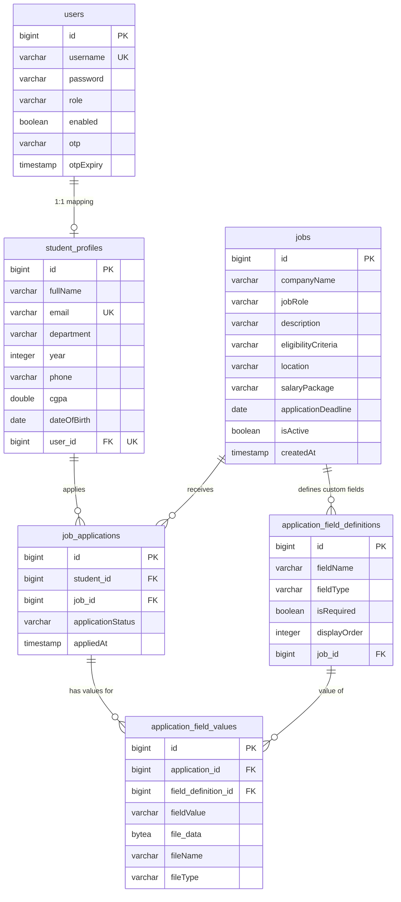

# Placement Portal - Database Schema Design

This document outlines the database schema for the Placement Portal project. The design is based on the JPA entities mapped in the Spring Boot backend.

## Tables Details

### 1. `users`
Stores all authentication credentials for Admins and Students.
- `id` (Primary Key, BIGINT)
- `username` (VARCHAR, Unique, Not Null)
- `password` (VARCHAR, Not Null)
- `role` (ENUM: `ADMIN`, `STUDENT`)
- `enabled` (BOOLEAN, default: true)
- `otp` (VARCHAR)
- `otpExpiry` (TIMESTAMP)

### 2. `student_profiles`
Contains the detailed profile information for an enrolled student. Includes a 1:1 mapped FK to the `users` table.
- `id` (Primary Key, BIGINT)
- `fullName` (VARCHAR, Not Null)
- `email` (VARCHAR, Unique, Not Null)
- `department` (VARCHAR, Not Null)
- `year` (INTEGER, Not Null)
- `phone` (VARCHAR, Not Null)
- `cgpa` (DOUBLE, Not Null)
- `dateOfBirth` (DATE)
- `user_id` (Foreign Key -> `users.id`, Unique, Not Null)

### 3. `jobs`
Represents the available job postings created by Admins.
- `id` (Primary Key, BIGINT)
- `companyName` (VARCHAR, Not Null)
- `jobRole` (VARCHAR, Not Null)
- `description` (VARCHAR, length: 2000)
- `eligibilityCriteria` (VARCHAR, length: 1000)
- `location` (VARCHAR)
- `salaryPackage` (VARCHAR)
- `applicationDeadline` (DATE, Not Null)
- `isActive` (BOOLEAN, Not Null, Default: true)
- `createdAt` (TIMESTAMP, Not Null)

### 4. `job_applications`
Tracks applications submitted by students for specific job postings.
- `id` (Primary Key, BIGINT)
- `student_id` (Foreign Key -> `student_profiles.id`, Not Null)
- `job_id` (Foreign Key -> `jobs.id`, Not Null)
- `applicationStatus` (ENUM: `PENDING`, `SUBMITTED`, `ACCEPTED`, `REJECTED`, Default: `SUBMITTED`)
- `appliedAt` (TIMESTAMP, Not Null, Updatable: false)
- **Constraints**: Custom Unique constraint on [(student_id, job_id)](file:///c:/Users/apras/Desktop/placementportal/src/main/java/com/placement/portal/entity/Job.java#14-63).

### 5. `application_field_definitions`
Allows admins to create dynamic/custom fields (like Resume upload or custom questionnaire) specifically for each job posting.
- `id` (Primary Key, BIGINT)
- `fieldName` (VARCHAR, Not Null)
- `fieldType` (ENUM: `TEXT`, `TEXTAREA`, `URL`, `NUMBER`, `DATE`, `EMAIL`, `PHONE`, `FILE`)
- `isRequired` (BOOLEAN, Default: true)
- `displayOrder` (INTEGER, Default: 0)
- `job_id` (Foreign Key -> `jobs.id`, Not Null)

### 6. `application_field_values`
Stores the actual data/values inputted by the students for the dynamically created custom fields during the job application process.
- `id` (Primary Key, BIGINT)
- `application_id` (Foreign Key -> `job_applications.id`, Not Null)
- `field_definition_id` (Foreign Key -> `application_field_definitions.id`, Not Null)
- `fieldValue` (VARCHAR, length: 2000)
- `file_data` (BYTEA - Stores binary data like files/resumes)
- `fileName` (VARCHAR)
- `fileType` (VARCHAR)
